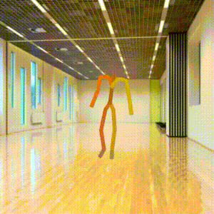
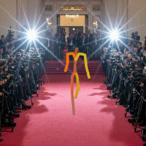

<div align="center">

# TIDMG: Text-Image Driven Motion Generation

_A research implementation of my MSc dissertation (full title: **TIDMG: Text-Image Driven Motion Generation with Unified Attention and Adaptive Conditioning**)_

### A person got down and is crawling across the floor


### A person walks forward with wide steps


### 🎥 Demo: Running TIDMG Code
👉 [**Watch Demo Video on Google Drive**](https://drive.google.com/drive/folders/1PjbXxfaFSeDkgsR7ml3aRiVnTD6GNjP3?usp=drive_link](https://drive.google.com/drive/folders/1PjbXxfaFSeDkgsR7ml3aRiVnTD6GNjP3?usp=drive_link)

</div>

---

## 📄 Thesis
[Read the full dissertation (PDF)](TIDMG_paper.pdf)

---

## 📘 Project Overview


TIDMG is my MSc project: a diffusion-based model that turns text—optionally with a scene image—into 3D human motion using unified conditioning, a single-pass attention block, and AdaLN. On HumanML3D and a small scene subset it improves alignment/diversity and lowers compute. This repo includes quick demos, visualization, and setup instructions.


---

## 📦 Demo & Dataset

- **Scene subset (images / configs / demo video)**:  
  👉 **[Google Drive Folder](http://google.com/drive/u/0/folders/1PjbXxfaFSeDkgsR7ml3aRiVnTD6GNjP3)**

- **HumanML3D (official data source for text–motion pairs)**:  
  👉 **[Kaggle: HumanML3D](https://www.kaggle.com/datasets/mrriandmstique/humanml3d)**

> Access tips  
> • Set the Drive folder permission to **“Anyone with the link – Viewer”**.  
> • HumanML3D is large and licensed — **do not redistribute raw data** here; download from Kaggle and follow their terms.

**Local path config (example)**
```text
DATA_ROOT=/path/to/HumanML3D
SCENE_ROOT=/path/to/scene_subset   # if you download the Drive scene data locally
CHECKPOINTS=./save/humanml_trans_enc_512/
OPTS=./assets/humanml_opt.txt
